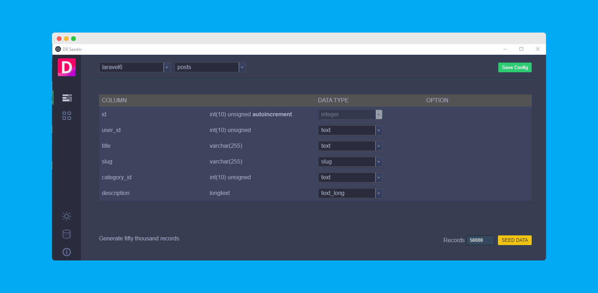

<h1 align="center">DB Seeder</h1>

<p align="center"><a href="https://laravelarticle.com/db-seeder"></a>
<a href="https://twitter.com/laravelarticle"></a>
<a href="https://facebook.com/laravelarticle"></a></p>

<p align="center">
A free dummy data generation tool for MySQL. You can generate data for Laravel, WordPress, Drupal, Joomla or any framework or raw PHP project without writing any code or using any third-party package.
</p>

<p align="center">
  

  
</p>

##  Operating System
<table><tr><td>Windows</td><td>Linux</td><td>macOS (Intel)</td><td>M1 Mac 2020</td></tr></table>

### Important for Mac OS
Run these command after install the app into `Applications` folder.

```
sudo xattr -rd com.apple.quarantine ~/Applications/dbseeder
```

```
sudo codesign --force --deep --sign - ~/Applications/dbseeder
```

## Download
[DB Seeder](https://github.com/haruncpi/db-seeder/releases)

## Documentation
[DB Seeder](https://laravelarticle.com/db-seeder)

## Support Us
- By giving star on GitHub project.
- By donating on this project.

## Data Type

- regex
- constant
- custom_list
- boolean
- integer
- number_range
- float
- word
- sentence
- text
- text_long
- address
- slug
- name
- email
- phone
- password
- male_name
- female_name
- time
- date
- date_range
- datetime
- timestamp
