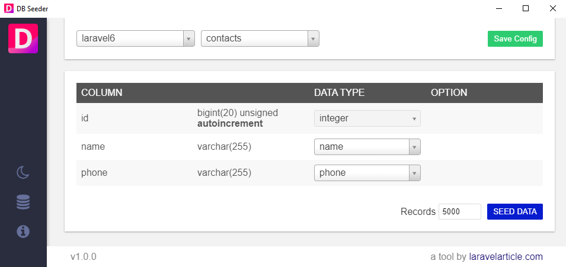

# DB Seeder

##  Operating System
Windows, Linux (Comming)

## Support Us
- By giving star on GitHub project.
- By donating on this project.

## Data Type

- regex
- constant
- custom_list
- boolean
- integer
- number_range
- float
- word
- sentence
- text
- text_long
- address
- slug
- name
- email
- phone
- password
- male_name
- female_name
- time
- date
- date_range
- datetime
- timestamp

## Download
[DB Seeder](https://github.com/haruncpi/db-seeder/releases)

## Documentation
[DB Seeder](https://laravelarticle.com/db-seeder)
